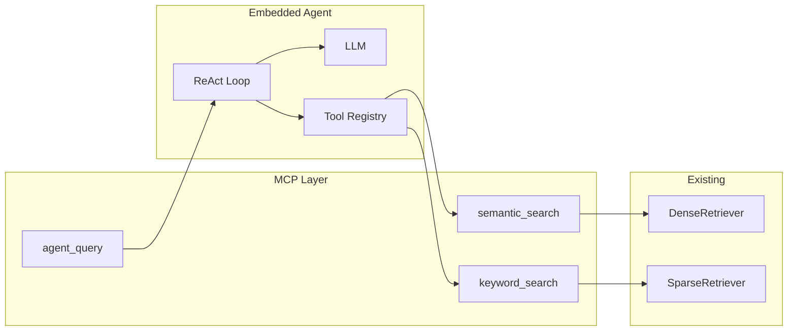

# Agent 扩展 MVP 计划

## 目标

- **内置 Agent**：在仓库内实现一个 ReAct 风格的计划-执行循环（Think → Act → Observe → 循环），由 LLM 决定每一步调用哪个工具、何时结束。
- **原子工具**：新增 2 个 MCP 工具，供 Agent（以及未来外部 Client）直接调用：
  - `keyword_search`：仅 BM25 稀疏检索。
  - `semantic_search`：仅 Dense 向量检索。
- **统一入口**：新增 MCP 工具 `agent_query`：用户输入自然语言问题，由内置 Agent 多步调用上述工具并生成最终回答。
- **MVP 范围**：不实现会话状态、不实现 verify_fact；先跑通单轮 agent_query 演示与脚本 demo。

## 架构示意

- **数据流**：`agent_query(query)` → Agent 循环 → 每轮 LLM 输出 Thought + Action（tool_name + args）→ 解析并调用 `keyword_search` / `semantic_search` → 将工具返回作为 Observation 拼回 Prompt → 下一轮直到 LLM 输出 Final Answer 或达到 max_steps。

## 一、新增原子 MCP 工具（复用现有检索）

### 1. keyword_search

- **职责**：仅做 BM25 检索，返回与 `query_knowledge_hub` 相同结构的检索结果（文本 + 引用）。
- **实现**：
  - 新建 `src/mcp_server/tools/keyword_search.py`。
  - 复用 `SparseRetriever`，按 collection 初始化（可参考 `query_knowledge_hub` 的 `_ensure_initialized` 模式）。
  - 参数：`query: str`, `top_k: int = 5`, `collection: str | None`。
  - 返回：复用 `ResponseBuilder` 生成 Markdown + citations。

### 2. semantic_search

- **职责**：仅做 Dense 向量检索，返回格式同上。
- **实现**：
  - 新建 `src/mcp_server/tools/semantic_search.py`。
  - 复用 `DenseRetriever`，按 collection 初始化。
  - 参数与返回与 keyword_search 对称。

两工具均在 `src/mcp_server/protocol_handler.py` 的 `_register_default_tools` 中注册。

## 二、内置 Agent 模块（ReAct 循环）

### 3. Agent 包结构

- 新建目录 `src/agent/`：
  - `__init__.py`
  - `react_agent.py`：ReAct 循环核心。
  - `tools.py`：Agent 侧工具抽象（名称、描述、参数 schema、执行函数）；内部调用 keyword_search / semantic_search 底层检索逻辑。
  - `prompts.py`：ReAct 系统 Prompt（可用工具说明、输出格式：Thought / Action / Observation / Final Answer）。

### 4. ReAct 循环逻辑（react_agent.py）

- **输入**：`query: str`, `collection: str = "default"`, `max_steps: int = 5`。
- **工具**：注册 `keyword_search`, `semantic_search`。
- **每轮**：
  1. 拼 Prompt（系统 + 历史 Thought/Action/Observation + 当前问题）。
  2. 调用 `LLMFactory.create(settings).chat(messages)`。
  3. 解析输出：若含 `Final Answer:` 则返回；否则解析 `Action: tool_name(args)`，执行工具，将结果作为 Observation 追加，下一轮。
- **输出**：最终答案字符串；可选返回中间步骤供调试。
- **边界**：工具异常时把错误信息作为 Observation；达到 max_steps 未得到 Final Answer 时用最后一轮或固定文案。

### 5. LLM 输出解析

- 约定格式：`Thought: ...` / `Action: keyword_search(query="...", top_k=5)` / `Observation: ...` / `Final Answer: ...`。
- 解析用正则或字符串切分；Prompt 中强调严格按格式输出。

## 三、MCP 入口与注册

### 6. agent_query 工具

- 新建 `src/mcp_server/tools/agent_query.py`。
  - 参数：`query: str`, `collection: str | None`, `max_steps: int = 5`。
  - 内部：调用 `src.agent.react_agent.run_agent(...)`，用 `asyncio.to_thread` 包装同步调用。
  - 返回：MCP CallToolResult，content 为最终答案。
- 在 `_register_default_tools` 中注册 `agent_query`。

## 四、配置与依赖

- Agent 使用现有 `settings.llm`，无需新配置块；max_steps 可写死 5。
- 不新增第三方库；复用 `src.libs.llm`、`src.core.query_engine`、ResponseBuilder。

## 五、Demo 与验证

- 新增 `scripts/agent_demo.py`：命令行 `--query`、`--collection`，调用 `run_agent`，打印最终答案与步骤。
- 验证：通过 Cursor/Claude 调用 `agent_query` 或运行 `scripts/agent_demo.py`，确认能调用至少 1 次检索工具并返回合理答案。

## 六、文件清单

| 操作 | 路径 |
|------|------|
| 新增 | `src/agent/__init__.py` |
| 新增 | `src/agent/prompts.py` |
| 新增 | `src/agent/tools.py` |
| 新增 | `src/agent/react_agent.py` |
| 新增 | `src/mcp_server/tools/keyword_search.py` |
| 新增 | `src/mcp_server/tools/semantic_search.py` |
| 新增 | `src/mcp_server/tools/agent_query.py` |
| 新增 | `scripts/agent_demo.py` |
| 修改 | `src/mcp_server/protocol_handler.py`（注册 3 个新工具） |

## 七、不包含在 MVP（后续迭代）

- verify_fact / self_check 工具。
- 会话状态、多轮对话。
- agent 配置段 in settings.yaml。
- 单元/集成测试（建议跑通 demo 后补）。
